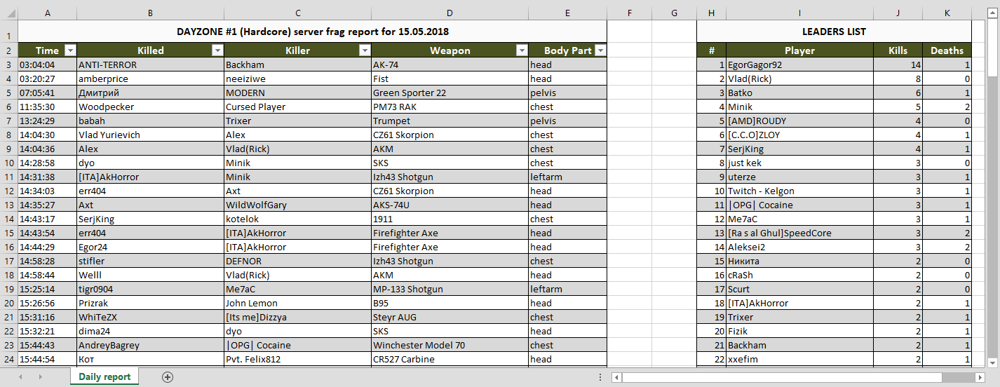

# DayZ Warlog
DayZ Standalone v0.62 frag report generator. Reports are based on previously parsed server admin logs.

## Installation
1. Build executable;
1. Download and install PostgreSQL 10 from [official website](https://www.postgresql.org/download/);
1. Create a configuration file called `config.yml` as follows:
```
logfile: server.log
lang: en     # lang/%lang%.yml

# Database settings

db: 
  host:     localhost 
  name:     dayzone # database name
  user:     postgres
  password: postgres
  port:     5432
  sslmode:  disable    # leave "disabled" if you don't know what it does


# Servers setup. Each line with dash in the beginning is a separate DayZ SA server. 
# You can keep as mush servers as you want in one Warlog database. 
# "name" parameter is used as internal identificator and must contain latin letters, underscores and numbers only. 
# "fullname" parameter will be inserted in the header of frag report table. 

servers:
- name: dayzone_hardcore
  fullname: "DAYZONE #1 (Hardcore)"
- name: dayzone_survival
  fullname: "DAYZONE #2 (Survival)"
``` 

## Usage 

1. Parse several server log files into Warlog with ``parse`` command; 
1. Generate frag report for a specific date that existed in one of the previously parsed server logs. Use ``report`` command.

Command line: 

`dayz-warlog <command> [<args>]`

**Available commands:**

`parse` - Parse DayZ SA server log file in Warlog database.

Example: `dayz-warlog parse -file=dayz.ADM -server=dayzone_hardcore`

`report` - Generate frag report in XLSX format for a specific day (in `DD.MM.YYYY` format).

Example: `dayz-warlog report -date=15.05.2018 -server=dayzone_hardcore`

## Database 
Warlog stores each server log in a separate PostgreSQL schema. For example, for the server named **dayzone_hardcore** the schema name will be **srv_dayzone_hardcore**. For **my_super_dayz_server** it would be **srv_my_super_dayz_server** and so on.

Database structure for the example config:
```
├─ [database] dayzone
│   ├─ [schema] public
│   │   ├─ [table] body_parts
│   │   └─ [table] weapons
│   ├─ [schema] srv_dayzone_hardcore
│   │   ├─ [table] damage_events
│   │   ├─ [table] kill_events
│   │   ├─ [table] players
│   │   └─ [table] server_events
│   └─ [schema] srv_dayzone_survival
│       ├─ [table] damage_events
│       ├─ [table] kill_events
│       ├─ [table] players
│       └─ [table] server_events
``` 

`public` schema is commonly used by every server you have configured and it is the one that you might want to edit. It contain `body_parts` and `weapons` tables. They are filled during each parsing process. There are two string columns in each of them - `name` and `report_name`. 

`name` is used internally as a search field for SQL queries. 

`report_name` is being inserted in frag report table during it's generation process instead of `name` only if it's set. If `report_name` is NULL, the `name` column value will be used in the final frag report.

## Translations
You can edit strings that used in report generation. Just add a file named `lang/%your_language%.yml`, then change the `lang` parameter value to `%your_language%` in configuration file.

### Frag report example
